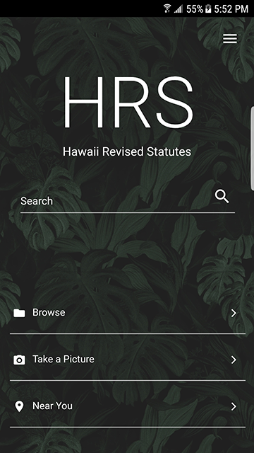
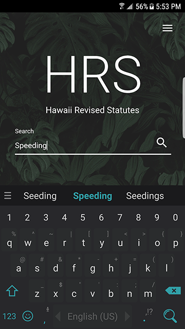
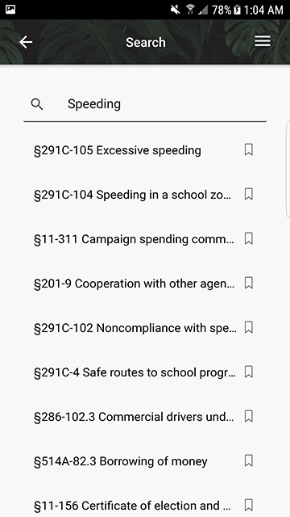
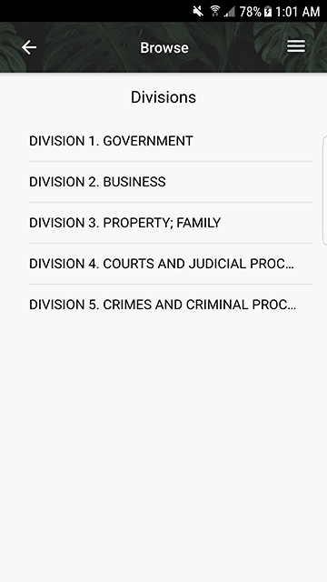
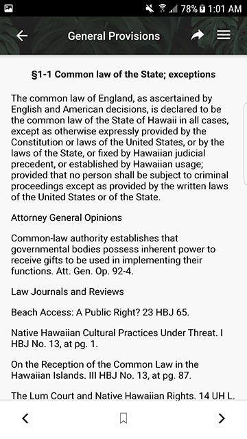
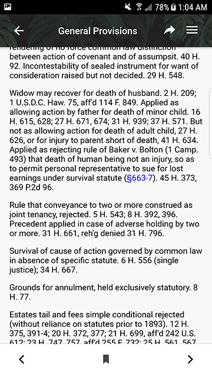
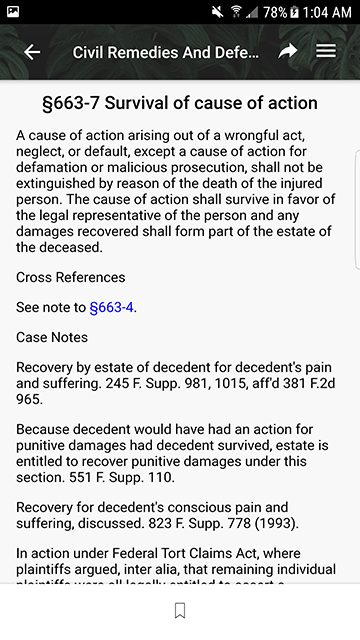

# Table of contents

* [About OpenHRS](#about-openhrs)
  * [Inspiration](#inspiration)
* [What we built](#what-we-built)
* [Mobile App](#mobile-app)
  * [How to install](#how-to-install)
    * [Prerequisites](#prerequisites)
    * [Quick start](#quick-start)
  * [How to develop](#how-to-develop)
    * [Emulating on Android Studio](#emulating-on-android-studio)
    * [Building the Android Project into an APK file](#building-the-android-project-into-an-apk-file)
  * [How to use](#how-to-use)
    * [Search](#search)
    * [Browse](#browse)
    * [Taking a pic](#taking-a-pic)
    * [Searching nearby Laws](#searching-nearby-laws)
* [Backend API](#backend-api)
  * [How to use](#how-to-use-api)
  * [How to develop](#how-to-develop-api)
* [Web Scraper](#web-scraper)
  * [How to install](#how-to-install-scraper)
  * [How to use](#how-to-use-scraper)
  * [how to develop](#how-to-develop-scraper)
* [Elasticsearch](#elasticsearch)
  * [How to load data](#how-to-load-openhrs-data)
* [About OpenHRS development](#about-openhrs-development)
  * [Milestone 1 Updated Scraper and Code Cleanup](#milestone-1-updated-scraper-and-code-cleanup)
  * [Milestone 2 Full Integration of Previous Years Data](#milestone-2-full-integration-of-previous-years-data)

# About OpenHRS

[](http://www.youtube.com/watch?v=ysAzR5RSkQk)

OpenHRS is the forward looking iteration of HRS App, a second place winning submission for the Hawaii Code Challenge 2017. The HRS App has been opened, in many different respects, to be improved by not only its original four developers, but by the community it was designed for. The opening of our original HRS App was the logical next step to keep it self sustaining. The HRS App was developed to effectively search the current Hawaii Revised Statutes in a way that was new and innovative. But innovation is finite if the technology behind it is restricted to a small group of students, and thus it has evolved into OpenHRS.

OpenHRS takes into account the following issues:

* Can't effectively search the current HRS.
* Can't find cross references in the HRS.
* Difficult to search for statutes located on signs around Hawaii.
* Not knowing what laws are relevant to your location.
* Having to note down laws you reference daily.

## Inspiration
Our inspiration comes from our core belief that “boring” subjects aren’t destined to be boring, but are misrepresented and unimaginatively produced. When designed with creativity, anything can be fun, interesting, and yet still as enlightening.

Rather than taking the easy route and creating a basic search and browse, we thought outside the box and added additional but necessary features in hopes that it’d help modernize the way the people of Hawaii build software in the future

# What we built
We created a powerful retrieval system for Hawaii’s laws built upon the latest human computer interaction principles and mobile design patterns. What you might expect from our app is countless directories of laws to navigate through, but instead you are presented with an app elegantly designed and engineered to enhance your exploration through thousands of laws waiting to be discovered.

Some issues that the current Hawaii Revised Statutes has include:

* No database for nearly 20,000 statutes
* Can't effectively search the current HRS site.
* Can't find cross references in the HRS site.
* Difficult to search for statutes located on signs around Hawaii.
* Not knowing what laws are relevant to your location.
* Having to note down laws you would like to reference in the future.

To combat those issues, we implemented:

* MongoDB database, with the future in mind for scalability.
* An organized RESTful API to allow anyone to interpret our statute data.
* Gorgeous, streamlined, user-friendly User Interface.
* State of the art search engine.
* Optical Character Recognition (OCR) system to allow a user to take a picture of a physical sign and receive the relevant statute.
* Statute locations near the user for extra awareness.


# Mobile App

## How to install

### Prerequisites
- [Node.js](https://nodejs.org/en/download/)

To install ionic, use the commands:

`$ sudo npm install -g cordova`

`$ sudo npm install -g ionic`

### Quick start

Clone the Repository

`$ git clone https://github.com/OpenHRS/openhrs-mobile-app.git && cd openhrs-mobile-app`

Install Packages

`$ npm install`

Run as Web Application

`$ ionic serve`


## How to develop

### Emulating on Android Studio
To emulate on an Android Emulator/Device to use all the features:

1. Download Android Studio https://developer.android.com/studio/index.html
2. in the client directory, use the commands:

   2a. `$ ionic cordova platform add android`

   2b. `$ ionic cordova build android `

   2c. `$ ionic cordova emulate android` or `ionic cordova run android` (Requires Android Device)


3.  If you receive an error in step 2c, try the following procedure:

   (1) Open Android Studio.
   (2) Click 'Open an existing Android Studio project'
   (3) Navigate to '/platforms/android'
   (4) Create an AVD, if you don't have one already using AVD Manager in Android Studio
   (5) The Run button (green triangle) should be activated, click it
   (6) Set the operating system to Android 7.0 Nougat, and choose a device that can run the OS (e.g. Google Pixel)
   (7) Close Android Studio and repeat step 2c.


### Building the Android Project into an APK file

1. Customize the config.xml based on desired build settings, it can be found in /platforms/android/res
2. In the openhrs-mobile-app directory, use the command:
    $ ionic cordova build --release android
3. Find the unsigned APK file in platforms/androids/build/outputs/apk and run an alignment utility on it
   3a. If you have a signing key, you are finished. If not, continue on:
4. Generate a private key for it using the keytool command that comes with the JDK:
    $ keytool -genkey -v -keystore my-release-key.keystore -alias alias_name -keyalg RSA -keysize 2048 -validity 10000
4a. If the tool can't be found, refer to 'http://ionicframework.com/docs/v1/guide/installation.html'
5. Create a password for the keystore, answer its questions, and you will get a file called 'my-release-key.keystore'
   in your current directory
6. Run the jarsinger tool to sign the unsigned APK:
    $ jarsigner -verbose -sigalg SHA1withRSA -digestalg SHA1 -keystore my-release-key.keystore HelloWorld-release-unsigned.apk alias_name
7. Run the zipalign tool found in '~/Library/Android/sdk/build-tools/VERSION/zipalign' and run:
    $ zipalign -v 4 HelloWorld-release-unsigned.apk HelloWorld.apk
8. You will now have your final release binary called "HelloWorld.apk", HelloWorld replaced by whichever name you chose
    in your previous steps.

## How to use
After opening the app, you are first welcomed with the homepage:



From there, you are able to do a general search, browse the HRS, take a picture, or search nearby laws.
### Search
Using search is very easy. Just type in a term you are looking for, a chapter, section, or both chapter and section. The search engine will do its best to return the closest results.

Here's an example:





Searching for 'speeding' yields results related to speeding.

### Browse
When opening browse, you will reveal the list of divisions within the HRS.



From there, you can browse through the divisions, titles, chapters, and sections.

Here is what a section may look like



Here, you can see the information about the statute.

In some sections, you may see a cross reference to another statute like this.



You can select it to reveal information about it as well.


### Taking a Pic
This feature allows the user to quickly snap a photo on their mobile device and our image recognition software will redirect the user to a found statute.


### Searching nearby Laws
This feature allows the user to use their location to view nearby laws. These laws are generated from signs that have been successfully scanned with our application.


# Backend API
We are no longer hosting our api. Instead, we are utilizing aws lambda to handle our I/O operations and aws api gateway to handle request.
## How to Use API
### Searching
https://bn8d8e4oc9.execute-api.us-west-1.amazonaws.com/prod/search?size=*response size*&input=*search term*
### Get by chapter and section
https://bn8d8e4oc9.execute-api.us-west-1.amazonaws.com/prod/num?chapt=*chapter*&sec=*section*
## How to Develop API
Any additional functionality should be built with aws lambda. Any updates to existing code should comply with its programming model (Node, Python, Java, C#). If using lambda proxy integration, ensure function returns the required [json object](http://docs.aws.amazon.com/apigateway/latest/developerguide/api-gateway-create-api-as-simple-proxy-for-lambda.html).

# Web Scraper
A BeautifulSoup based scraper that scrapes all HRS data from http://www.capitol.hawaii.gov/hrscurrent/ using the table of contents (http://www.capitol.hawaii.gov/docs/HRS.htm) as a reference to structure and organize all the data.

## Installation and Running it

It would be recommended to create a virtual environment to hold all the dependencies.

1. To create your virtual environment through pip:

Make sure you have Python 3.6+ installed on your computer

```
pip install virtualenv
virtualenv env
source env/bin/activate
```

2. To install the dependencies:
```
python pip install -r requirements.txt
```

3. To run it:
```
python create_hrs_tree.py <notext> <hrs[current|year]>
```
Given a year, it will output a file named `hrs[current|year][_notext].json`.

When passed the `notext` option, it will scrape names statute names only.

Examples:
```
python create_hrs_tree.py notext hrscurrent
```
It will output a file named `hrscurrent.json` with all the current Divisions, Titles, Chapters, and Section names + numbers in a tree format. Notice the `notext` arg will not output section text.


```
python create_hrs_tree.py hrs2016
```
Similarly, will ouput a file named `hrs2016.json` with the data as `notext` along with section text.

## Testing
For development purposes only, testing scripts have been created named `testing_xxxx.py` where xxxx is the part to be tested. These scripts will output a similar json file named `testing_xxxx.py` with the resulting data.

## How to Develop
Currently any issues with the scraper are found in the issues tab, so development of any features or patching of any issues in a separate branch then a pull request made once completed is recommended. In the `scraping_testers` folder, a scoped tool scraper is provided to individually test titles, chapters, and section, so use of these is highly recommended.

# Elasticsearch
We use elasticsearch to handle our search operations.
## How to load OpenHRS data
1. clone both openhrs-data and openhrs-elastic into same directories.

2. Specify elasticsearch url in ELASTIC_URL environment variable.

3. in openhrs-elastic repo, run
```
pip3 install -r requriements.txt

python3 load.py or python3 load.py ssl (if using ssl)
```


# About OpenHRS development
OpenHRS was developed as part of an effort to improve the efficiency of the Hawaii State Government.

## Milestone 1 Updated Scraper and Code Cleanup
The bulk of this milestone consisted of improving the quality of our existing code, making it more understandable, maintainable, and modifiable. In essence, our code has been updated to align with our current philosophy of openness. Due to the nature of coding competitions, much of our code was rushed and could've been written more elegantly.

On the front end, much of the CSS has been removed from the ionic templates and put into the respective component's scss files. Bugs that have crippled user experience have been patched, for example the arrow keys on each search result page have been fixed to function as they were meant to. Global CSS variables have been moved to their respective component files to allow for easier customization. Insignificant files that may confuse potential contributors have been removed.

On the backend, we refactored our code and implemented dependency injection for our services. We also containerized our application for easier deployment. By doing this, we hope that it will be easier for the open source community to develop and contribute to the project.


## Milestone 2 Full Integration of Previous Years Data
This milestone primarily consisted of integrating support for data from previous years. The idea behind this is to allow users to quickly and easily compare statutes between years to gather specific information that they may need.

Slight enhancements have been made to the mobile user interface. Forward and back arrows have been added to Division and Title pages for easier navigation. In order to maintain a consistent design across the app, the arrows have been placed in a toolbar similar to that present in individual statute pages.

Much of the scraper was refactored in order to allow for an abstract way of scraping data between all years. The structure of HTML differed between sections of years, so the scraper had to take this into account. We've also integrated test scraping files to allow for quick development of certain aspects of the scraper. A script to format the data in a data structure was created to interpret the data easily. Although there are issues with scraping some statutes still, there aren't that many (less than 1%).  

As a result of the improved scraper, we were able to do more with the data than what was avaiable to us previously. By having all the data in a github repo, we no longer have a need to host a mongo database and have a dedicated service to browse the HRS. In addition, we see the potential of improving our search service by being able to search between all years of the hrs. We are no longer constrained by a single year and hope that we can continue to take advantage of elasticsearch.  

The team includes:

  * [Jonathan Robello](https://www.linkedin.com/in/jonathan-robello/)
  * [Terry Palomares](https://www.linkedin.com/in/terry-palomares/)
  * [Chris Oh](https://www.linkedin.com/in/christopher-oh-9a1135133/)
  * [Dan Paguirigan](https://www.linkedin.com/in/danpaguirigan/)
  * [Derek Chan](https://www.linkedin.com/in/derek-chan-152378128/)
  * [Kurt Noe](https://www.linkedin.com/in/kurt-noe-39ab19112/)
